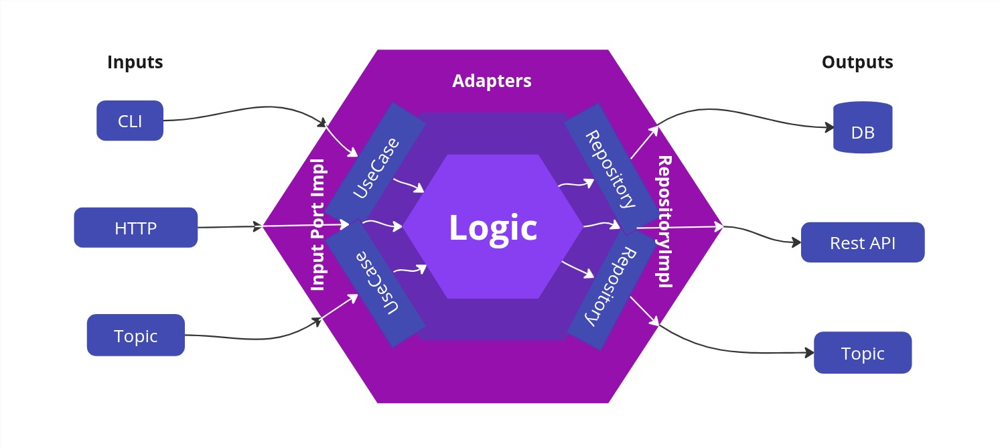

# Recipes Cart Application


This project extends a basic e-commerce platform to support the purchase of entire recipes. 
Instead of adding products individually to the cart, users can now add a complete recipe — which includes multiple 
ingredients — in a single request. 

## 📌 Assumptions
- All products are assumed to be always available (no inventory checks)
- Authentication and authorization are not implemented
- Recipes/Products must already exist in the database (no recipe or product creation endpoint)
- Designed for local use; can be configured for production with minimal changes.

## 🚀 Running the Application Locally
###  ✅ Prerequisites
Before you start, make sure you have the following installed:
- Docker
- Docker Compose

Note: Docker Compose is included in Docker Desktop on Windows and macOS. On Linux, it might need to be installed separately.

### 🛠️ How to Run
To build and start the entire application and database locally using Docker, simply run:

```
make up
```

This will:
- Build the application Docker image
- Start the PostgreSQL database container
- Wait for the database to be ready
- Automatically apply Flyway migrations
- Seed the database with local data (only in development)
- Start the Spring Boot application on port 8080

### 🛑 How to Stop
To stop the application and database:
```
make down
```

### 💣 How to Fully Reset Everything (including volumes and seed data)
```
make destroy
```

## 👩‍💻 Developer Guide
### ✅ Prerequisites
To run tests and development tools locally (without Docker), you need:
- JDK 21+
- Gradle (or use the included `./gradlew` wrapper)
- Docker
- Docker Compose (only if you want to use make up to start the full environment)

### 🧪 Running Tests
To run all unit and integration tests in parallel:
```
make test
```
Or directly with Gradle:
```
./gradlew test --parallel
```

### ✅ Linting
Check code formatting:
```
make lint
```

Fix formatting issues automatically:
```
make lint-fix
```

### 🛡️ Pre-Commit
Before committing code, you can run:
```
make pre-commit
```

This will:
- Run ktlint with auto-fix
- Run all tests in parallel

### 🔗 Optional: Automatically Run Pre-Commit Checks
You can configure Git to run make pre-commit automatically before every commit by installing a Git pre-commit hook.

To set it up:
```
make install-hooks
```
This will copy a pre-configured Git hook to .git/hooks/pre-commit, which runs `make pre-commit` and blocks the commit if any check fails.

### 🔁 Hot Reload with DevTools

To run the application with Spring Boot DevTools enabled (which supports hot reload on code changes), use:

```
make dev
```

### 📬 Bruno API Collection

You can use the [Bruno](https://www.usebruno.com/) collection under the `bruno/` directory to explore and test the available HTTP endpoints.

To open it:
1. Install Bruno
2. Open the `bruno/` folder in the Bruno app
3. Make sure the application is running (`make up` or `make dev`)
4. Hit the endpoints locally via the preconfigured requests


### 📈 Observability with Spring Boot Actuator
This project includes Spring Boot Actuator to provide basic health and metrics endpoints:

| Endpoint            | Description                  |
|---------------------|------------------------------|
| `/actuator/health`  | Shows application health     |
| `/actuator/metrics` | Exposes application metrics  |

These endpoints are useful for monitoring, debugging, and verifying that the application is running correctly. 
You can test them after running `make up` or `make dev`.

## Architecture
This project follows the principles of Hexagonal Architecture (a.k.a. Ports and Adapters) to enforce a clean separation 
of concerns, improve modularity, and make the codebase easier to maintain, test, and evolve over time.

Each layer of the application is implemented as a separate Gradle module, preventing unintended dependencies between 
layers and ensuring a clear boundary between core business logic and external concerns.



### 🧠 Domain Layer (domain module)
This is the core of the application and contains all business logic. It defines:
- Entities and value objects that represent core concepts like Cart, Recipe, and CartItem.
- UseCase classes, which represent application-specific business use cases. These are the main entry points for executing business rules.
- Repository interfaces, which act as output ports. They abstract away persistence and other side effects, allowing the domain to remain decoupled from infrastructure concerns.

The domain layer knows nothing about external systems or frameworks. It is purely written in Kotlin and can be tested in isolation.

### 🧾 Output Ports (output/ directory)
These modules implement the interfaces (output ports) defined in the domain. In this project, the `output/postgres` module:
- Implements the Repository interfaces using a relational database (PostgreSQL).
- Encapsulates all data access logic and SQL statements.

Additional adapters like message queue producers, external APIs, or experiment flag checkers could be added here in 
the future, without affecting the domain.

### 🌐 Input Ports (input/ directory)
Input ports are responsible for receiving external requests and invoking the appropriate use cases. In this project:
- The `input/http-server` module exposes a REST API using Spring Web.
- It defines controllers for handling HTTP requests and delegates execution to the domain’s UseCase classes.

Other types of input modules (e.g. CLI commands, background jobs, queue consumers) could be added later under the same structure.

### 🚀 Application Bootstrap (app module)
The app module is the entry point of the application. It:
- Wires together all modules and dependencies using Spring Boot.
- Configures dependency injection for use cases and repository implementations.

Starts the HTTP server and provides runtime configuration.

### 🧪 Testing Strategy

The testing approach reflects the project’s modular architecture:

- **Unit tests** focus on isolated business logic inside the `domain` module (e.g. UseCases, value objects).
- **Integration tests** are implemented in each port module (e.g. `output/postgres`) to verify persistence behavior with a real PostgreSQL container using Testcontainers.
- **End-to-end integration tests** run in the `app` module and call the system through the input ports (HTTP API). These tests boot the full application and validate actual runtime behavior.

This structure ensures each module can be tested in isolation and promotes confidence in the application end-to-end.

### ✅ Benefits of this architecture
- **Separation of concerns**: Business logic is completely isolated from external systems and how data is received or exposed.
- **Modularization**: Each module has a single responsibility and can be developed and tested independently.
- **Flexibility**: It’s easy to swap or add input/output ports (e.g. REST, GraphQL, queues) without changing core business logic.
- **Testability**: Business rules can be tested in isolation using only the domain module, while integration tests can focus on infrastructure modules.
- **Scalability**: The structure supports growing complexity without turning the codebase into a monolith.
